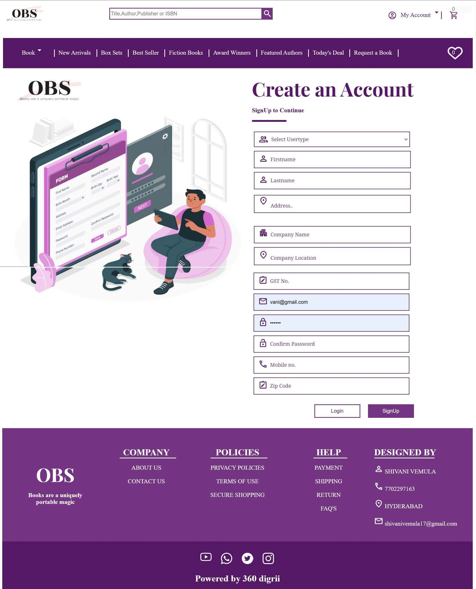

# OBS-online-book-store-
Overview
Welcome to the Online Bookstore Project! This project is designed to create a full-featured online platform for browsing, searching, and purchasing books. Our goal is to offer an intuitive shopping experience, efficient inventory management, user reviews, and personalized recommendations.

Features
User Authentication: Secure registration and login system.
Book Browsing and Searching: Navigate through categories, use advanced search options, and apply filters.
Detailed Book Information: Includes descriptions, author details, publication data, and customer reviews.
Shopping Cart: Add, remove, and update items in the shopping cart.
Checkout Process: Secure checkout with multiple payment options.
Order Management: Users can track and manage their orders.
Admin Dashboard: Manage inventory, track sales, and view analytics.
User Reviews and Ratings: Customers can leave reviews and rate books.
Recommendations: Personalized book recommendations based on user preferences and purchase history.

Technology Stack
Frontend: HTML, CSS, JavaScript, jQuery for building a responsive and interactive user interface.
Backend: Python with Django for handling server-side logic.
Database: MySQL for structured data storage and management.
Authentication: Django's built-in authentication system.
Payment Gateway: Integration with Stripe/PayPal for handling payments.
Hosting: Deployed on a suitable hosting platform for reliable service.

<h1>Home</h1> 
 

<h1>About Us</h1> 
 

<h1>Signup</h1> 
 

<h1>Login</h1> 
 
